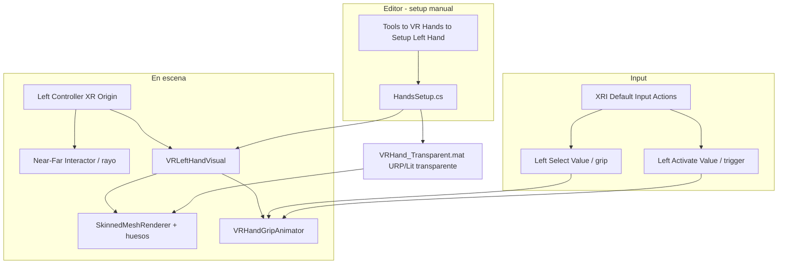

# VR Left Hand (Pistola Branch) — Agent Context

Documentación para agentes de IA que trabajen en la mano izquierda VR del simulador (`CleanCore`). Resume arquitectura, decisiones tomadas, bugs encontrados y soluciones aplicadas en la rama **pistola**.

**Escena principal:** `Assets/StylArts/StylizedHouseInterior/Scene/URP_Stylized_House_Interior.unity`
**XRI:** `com.unity.xr.interaction.toolkit` **3.1.3**
**Render Pipeline:** URP

---

## Propósito

Añadir una **mano izquierda visible y transparente** al jugador VR para:

- Indicar visualmente la posición del controlador izquierdo.
- Servir como "puntero" cuando el jugador apunta a menús (`InWorldMenuVR`).
- Permitir agarrar objetos (`KitchenSocketSystem`) con interacción visual clara.
- **No interferir** con la pistola del lado derecho (`Painter.cs` + WaterGun).

La mano derecha **no se toca** porque ahí está la pistola de agua. Esta rama solo afecta el controlador izquierdo.

---

## Arquitectura

---

## Mapa de archivos

| Archivo | Responsabilidad |
|---------|-----------------|
| `Assets/Editor/HandsSetup.cs` | Menú `Tools → VR Hands`; instancia mano, ajusta material, conecta input. **Idempotente** |
| `Assets/Scripts/VRMenu/VRHandGripAnimator.cs` | Lee grip/trigger y rota los huesos de los dedos. Detecta XRI Hands y VirtualGrasp (Gleechi) |
| `Assets/Scripts/Powerwash Simulator/Painter.cs` | Pistola de agua. Modificado: `disableFire2` + `ignoreLegacyMouseInput` |
| `Assets/Materials/VRHand_Transparent.mat` | Material URP/Lit transparente generado por `HandsSetup` (azul, alpha 0.85) |
| `Assets/com.gleechi.unity.virtualgrasp/Runtime/Resources/GleechiHands/GleechiLeftHand.fbx` | Modelo 3D usado (paquete VirtualGrasp Hand Poser - Test version 1.7.0) |

**Archivos eliminados en esta rama:**

- `Assets/Editor/GhostlyHandSetup.cs` — script previo basado en Ghostly Hand Shader; abandonado por bugs irresolubles del prefab XRI corrupto.

---

## Menú del editor (Tools → VR Hands)

| Menú | Acción | Cuándo usar |
|------|--------|-------------|
| **Setup Left Hand** | Comando principal: instancia la mano Gleechi en el controlador izquierdo, le aplica material transparente y cablea el animador | Cada vez que cambies de escena o quieras regenerar la mano |
| Remove Hands | Borra `VRLeftHandVisual` y cualquier mano legacy de runs anteriores | Limpieza |
| Force Recreate Material | Borra `VRHand_Transparent.mat` y lo regenera con los valores actuales del script | Si cambias el color/alpha en el código |
| Spawn Debug Cube On Left Controller | Cubo amarillo en el controlador izquierdo | Diagnóstico: si lo ves, la posición del controlador es correcta |
| Remove Debug Cube | Borra el cubo amarillo | Limpieza tras debug |
| Apply Solid Pink To Hand (Debug) | Aplica material rosa opaco al SMR de la mano | Diagnóstico: si se ve rosa, el material transparente es el problema |
| Setup Left Hand (Static Mesh Fallback) | Crea una mano de cubos (palma + 5 dedos como primitivas) | Fallback garantizado visible si el FBX falla |
| Debug Controllers | Loguea `Painter.leftController` / `rightController` y sus hijos | Verificar referencias del controlador |

Orden recomendado para uso normal: **`Setup Left Hand`** y listo.

---

## Lifecycle / Setup en Play

1. **Editor:** ejecutar `Tools → VR Hands → Setup Left Hand`.
2. **`HandsSetup.SetupLeftHand()`**:
   - Carga el FBX de `Assets/com.gleechi.unity.virtualgrasp/Runtime/Resources/GleechiHands/GleechiLeftHand.fbx`.
   - Crea/reusa material `Assets/Materials/VRHand_Transparent.mat`.
   - Busca `Painter.leftController` (fallback: busca por nombre objetos inactivos).
   - Activa controlador y todos sus ancestros.
   - Borra manos previas con nombres conocidos (`VRLeftHandVisual`, `GhostlyLeftHandVisual`...).
   - Procesa hijos del controlador: oculta el modelo del mando, **conserva interactores** (Near-Far, Teleport, Ray).
   - `Object.Instantiate(GleechiLeftHand.fbx, controller)` con position/rotation/scale ajustados.
   - Elimina componentes `VG_*`, `XRHand*`, `HandTracking*`, `HandVisual*`, `HandSkeleton*` y todos los `Collider`.
   - `GameObjectUtility.RemoveMonoBehavioursWithMissingScript` para evitar warnings.
   - Aplica el material a todos los `SkinnedMeshRenderer` + `MeshRenderer`.
   - `localBounds = Bounds(zero, 4*one)` para evitar frustum culling.
   - Añade `VRHandGripAnimator` y cablea `Select Value` / `Activate Value` por GUID.

3. **Play:** el animador rota los huesos según el grip/trigger del mando izquierdo en cada `Update`.

---

## Configuración por defecto

| Parámetro | Valor | Notas |
|-----------|-------|-------|
| `localPosition` | `(0.02, -0.05, 0.04)` | Ajustado para que los dedos envuelvan el origen del rayo |
| `localRotation` | `Euler(-90, -90, 90)` | Mano apuntando hacia adelante, perfil visible |
| `localScale` | `(0.45, 0.45, 0.45)` | ~55% más pequeña que el FBX original |
| Material | URP/Lit Transparent, `(0.30, 0.75, 1.0, 0.85)` | Azul claro semi-transparente |
| Bounds | `(0,0,0)` a `4x4x4` | Evita frustum culling con rig estático |

Los valores se pueden ajustar editando `HandsSetup.cs` o, más fácil, copiando los valores del Transform en Play y haciendo `Paste Component Values` en edit mode.

---

## VRHandGripAnimator

Anima los dedos sin depender de `XRHandSubsystem`.

### Detección de rig

Soporta dos convenciones de nombres en los huesos:

| Origen | Patrón |
|--------|--------|
| XRI Hands (`com.unity.xr.interaction.toolkit`) | `L_IndexProximal`, `L_ThumbDistal`, etc. |
| VirtualGrasp / Gleechi | `IndexA_L`, `ThumbC_L`, `PinkyB_L`, etc. (A=proximal, B=intermediate, C=distal) |

### Mapeo de input

| Input | Acción visual |
|-------|---------------|
| **Trigger** (Activate Value) | Cierra **solo** el índice → gesto de apuntar |
| **Grip** (Select Value) | Cierra medio, anular, meñique y pulgar |
| Ambos | Puño cerrado completo |

**Diseño intencional:** apretar grip = agarrar mando (los demás dedos se cierran), pero el índice queda libre para apuntar. Solo se cierra el índice al apretar trigger (pinch/click).

### Ejes de curl

| Rig | Eje del curl |
|-----|--------------|
| XRI Hands | X (eje horizontal) |
| Gleechi | Z (eje frontal) — configurable en `fingerCurlAxis` |
| Pulgar Gleechi | Y (eje vertical) — configurable en `thumbCurlAxis` |

Los huesos sin patrón conocido se ignoran (no contienen `Thumb|Index|Middle|Ring|Pinky|Little` o no terminan en `Proximal|Intermediate|Distal|A_L|B_L|C_L`).

---

## Painter — cambios

### `disableFire2 = true` (por defecto)

Antes: `fire2Action` (grip izquierdo) pintaba blanco (ensuciar). Resultado: cada vez que el usuario apretaba grip con la izquierda salía agua y ensuciaba.

Ahora: con `disableFire2 = true`, la izquierda **nunca dispara agua**. La izquierda queda libre para menús/agarrar.

### `ignoreLegacyMouseInput = true` (por defecto)

Antes: `Painter` tenía fallback `Input.GetButton("Fire1")`. "Fire1" en Legacy Input Manager está hardcoded al **click izquierdo del mouse**, por lo que cualquier click del usuario en la ventana Game disparaba agua, incluso al usar menús del XR Device Simulator.

Ahora: con `ignoreLegacyMouseInput = true`, **se ignora completamente** Input Manager. Solo dispara si el XRI Action está activo.

---

## Historial de bugs y soluciones

### 1. Shader Ghostly invisible en URP
**Causa:** El shader `GhostlyHandURP.shader` requiere "Opaque Texture" activado en el URP Asset; sin él, renderiza transparente al 100%.
**Solución:** Abandonar Ghostly Hand y usar URP/Lit Transparent. El material lo genera `HandsSetup.EnsureTransparentHandMaterial()` automáticamente, sin depender de settings del pipeline.

### 2. Prefab XRI LeftHandInteractionVisual no se renderizaba
**Causa:** Los prefabs del sample "Hands Interaction Demo" están riggeados para `XRHandSkeletonDriver`. Sin datos del subsystem de hand tracking real, el rig colapsa el mesh a (0,0,0).
**Diagnóstico:** Cubo amarillo en el controlador ✓; `Apply Solid Pink` ✗ → confirma que es el rig, no el material ni la posición.
**Solución:** Cambiar a `GleechiLeftHand.fbx` del paquete VirtualGrasp. Es un FBX con rig estándar y mesh que se renderiza sin scripts adicionales.

### 3. Click izquierdo del mouse disparaba agua
**Causa:** `Painter.Input.GetButton("Fire1")` capturaba el LMB del mouse en cualquier momento.
**Solución:** Toggle `ignoreLegacyMouseInput` que omite completamente Input Manager. La pistola solo responde a XRI Actions.

### 4. Grip izquierdo en simulador ensuciaba paredes
**Causa:** `fire2Action` cableado al grip izquierdo pintaba blanco (ensuciar).
**Solución:** Toggle `disableFire2` (default ON).

### 5. Mano flotaba lejos del controlador / no aparecía
**Causa:** El XR Origin estaba unpacked (por `KitchenSocketSetup`), por lo que las referencias serializadas a transforms internos del prefab podían quedar dangling.
**Solución:**
- `HandsSetup` usa `Object.Instantiate` en lugar de `PrefabUtility.InstantiatePrefab` para evitar overrides anidados.
- Busca controladores incluso entre objetos inactivos con `Resources.FindObjectsOfTypeAll<Transform>`.
- Activa toda la cadena de ancestros del controlador.

### 6. Frustum culling ocultaba la mano cuando bajaba el HMD
**Causa:** El SkinnedMeshRenderer sin animación del esqueleto tiene bounds locales degenerados; Unity la culling-off cuando los bounds parecen fuera de cámara.
**Solución:** `smr.localBounds = new Bounds(zero, one * 4f)` + `updateWhenOffscreen = true`.

### 7. Warnings "missing script" en VRLeftHandVisual
**Causa:** Al borrar componentes del FBX importado (XRHandTrackingEvents, etc.), Unity deja referencias rotas en el GameObject.
**Solución:** `GameObjectUtility.RemoveMonoBehavioursWithMissingScript` aplicado a todos los hijos tras la instanciación.

### 8. Mano grande / orientación incorrecta
**Causa:** El FBX de Gleechi viene a escala 1.0 y con axis convention de Blender (rotation -90 X implícita).
**Solución (iterativa):**
- Posición: `(0.02, -0.05, 0.04)` para alinear con el origen del rayo del Near-Far Interactor.
- Rotación: `Euler(-90, -90, 90)` para que apunte hacia adelante, perfil visible (no se ve la palma).
- Escala: `0.45` (~55% del FBX original).

### 9. Colliders de la mano bloqueaban el rayo
**Causa:** El FBX puede traer colliders por defecto que interfieren con el Near-Far Interactor.
**Solución:** `HandsSetup` elimina **todos** los `Collider` de la instancia tras crearla.

---

## Sistema de input

Las acciones se cablean automáticamente leyendo `Assets/Samples/XR Interaction Toolkit/3.1.3/Starter Assets/XRI Default Input Actions.inputactions` y buscando por GUID:

| Función | Action ID (Left) |
|---------|------------------|
| Grip (Select Value) | `e6005f29-e4c1-4f3b-8bf7-3a28bab5ca9c` |
| Trigger (Activate Value) | `0c3d0ec9-85a1-45b3-839b-1ca43f859ecd` |

Estos IDs son estables a lo largo de versiones del sample XRI Starter Assets.

---

## Compatibilidad con sistemas existentes

| Sistema | Estado |
|---------|--------|
| `Painter.cs` (pistola) | ✅ Coexiste; mano izquierda no dispara agua |
| `InWorldMenuVR` | ✅ La mano puede apuntar al menú con el rayo del Near-Far Interactor |
| `KitchenSocketSystem` | ✅ La mano permite agarrar (interaction layer "Cocina" en NearFarInteractor izquierdo) |
| `VRMenuToggleInput` (M / Menu button) | ✅ Sin cambios |

---

## Qué no hacer (agentes)

- **No re-añadir** Ghostly Hand Shader como dependencia; el material URP/Lit transparente funciona sin él.
- **No usar** los prefabs `LeftHandInteractionVisual` del sample XRI directamente; su rig requiere XR Hand Tracking real (no funciona con controles).
- **No modificar** la mano derecha; ahí va la pistola.
- **No quitar** `ignoreLegacyMouseInput` del `Painter` sin avisar al usuario; rompe la UX en el simulador.
- **No volver a poner** colliders en la mano sin un análisis de impacto sobre el Near-Far Interactor.
- **No re-añadir** scripts `VG_*` del paquete VirtualGrasp a la instancia de la mano; el motor de físicas de VirtualGrasp choca con `KitchenSocketSetup`.
- **No cambiar** los GUIDs hardcoded de las acciones de input sin actualizar también la documentación.

---

## Depuración

Filtrar consola: `[HandsSetup]`

| Log | Significado |
|-----|-------------|
| `=== Procesando VRLeftHandVisual en ... ===` | Comenzó el setup en el controlador correcto |
| `Activado nodo ancestro: X` | Encontró un ancestro inactivo y lo activó |
| `Eliminando mano previa: X` | Reemplazó una mano de un run anterior |
| `VRLeftHandVisual renderers: 1 SkinnedMeshRenderer + 0 MeshRenderer. WorldPos: ...` | Setup OK; verifica que `WorldPos` esté cerca del jugador |
| `VRLeftHandVisual listo. Grip: ... / Trigger: ...` | Input cableado correctamente |
| `!!! ... no tiene NINGUN renderer` | Prefab corrupto; usar `Setup Left Hand (Static Mesh Fallback)` |

**Diagnóstico por capas:**

1. **¿La mano existe en escena?** → `Debug Controllers` muestra los hijos del Left Controller.
2. **¿La posición es correcta?** → `Spawn Debug Cube On Left Controller`; si ves el cubo, la posición y cámara son correctas.
3. **¿El material es el problema?** → `Apply Solid Pink To Hand (Debug)`; si se ve rosa, ajusta el material transparente.
4. **¿El rig es el problema?** → si el cubo se ve pero la mano rosa no, usa el fallback estático.

---

## Paquetes externos requeridos

| Paquete | Versión | Uso |
|---------|---------|-----|
| `com.unity.xr.interaction.toolkit` | 3.1.3 | Near-Far Interactor, XR Origin, input actions |
| `com.unity.render-pipelines.universal` | URP 14+ | Shader URP/Lit (material transparente) |
| **VirtualGrasp Hand Poser - Test version** (Asset Store) | 1.7.0 | Modelo 3D `GleechiLeftHand.fbx` (solo el FBX se usa; scripts VG_* se eliminan al instanciar) |

**Asset Store link:** [VirtualGrasp Hand Poser - Test version](https://assetstore.unity.com/?q=virtualgrasp)

**Importación:** importar el paquete completo en `Assets/com.gleechi.unity.virtualgrasp/`. No mover el FBX a otra carpeta sin actualizar `HandsSetup.PreferredLeftPrefabPath`.

---

## Referencias

- Setup VR Menu: [`VR_MENU_SETUP.md`](VR_MENU_SETUP.md)
- VR Menu agentes: [`VR_MENU_AGENT_CONTEXT.md`](VR_MENU_AGENT_CONTEXT.md)
- Proyecto general: [`../AGENTS.md`](../AGENTS.md)
