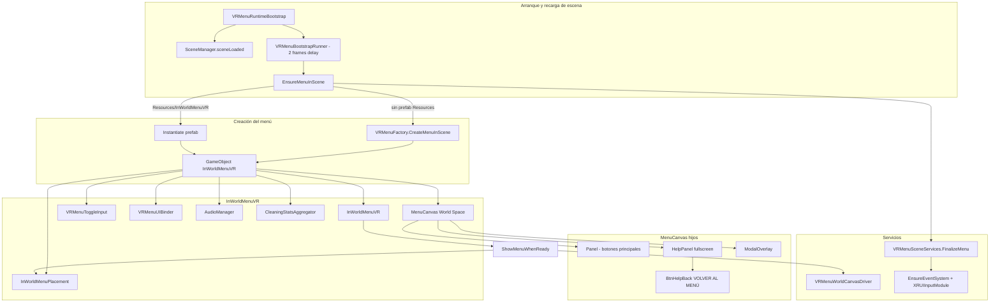

# VR In-World Menu — Agent Context

Documentación para agentes de IA que trabajen en el menú VR del simulador de limpieza (`CleanCore`). Resume arquitectura, historial de cambios, bugs corregidos y puntos delicados.

**Escena principal:** `Assets/StylArts/StylizedHouseInterior/Scene/URP_Stylized_House_Interior.unity`  
**XRI:** `com.unity.xr.interaction.toolkit` **3.1.3** (no 2.x; APIs equivalentes para UI VR).  
**Namespace XR:** `using Unity.XR.CoreUtils` — **no** `UnityEngine.XR.CoreUtils` (`XROrigin`).

---

## Propósito

Menú de configuración **World Space** en VR:

- Volumen ambiente / música (`AudioManager` + `MainMixer.mixer`)
- % global de limpieza (`CleaningStatsAggregator` → `PaintableSurfaceUI.Surfaces`)
- Recenter VR (`XRInputSubsystem.TryRecenter`)
- Reiniciar escena (modal) / Salir (modal)
- Ayuda (controles de limpieza + menú)

**No reemplaza** la UI de lista por superficie (`PaintableSurfaceUI`); coexisten.

---

## Arquitectura

---

## Mapa de archivos

| Archivo | Responsabilidad |
|---------|-----------------|
| `Assets/Scripts/VRMenu/VRMenuRuntimeBootstrap.cs` | Crea/repara menú al Play y en **cada** `sceneLoaded`; `ScheduleEnsureMenu` + runner de 2 frames |
| `Assets/Scripts/VRMenu/VRMenuFactory.cs` | Construye jerarquía UI completa en runtime si no hay prefab |
| `Assets/Scripts/VRMenu/InWorldMenuVR.cs` | Lógica, modales, `SetMenuVisible`, `ShowMenuWhenReady`, PlayerPrefs sliders |
| `Assets/Scripts/VRMenu/InWorldMenuPlacement.cs` | Posición `(0, 1.4, 2)` local vs `XROrigin`; `TryPlaceNow()` al abrir menú |
| `Assets/Scripts/VRMenu/VRMenuToggleInput.cs` | Toggle con **M** (legacy + Input System), Menu button Quest, Oculus Start |
| `Assets/Scripts/VRMenu/VRMenuSceneServices.cs` | `EnsureEventSystem`, `FinalizeMenu`, wiring botones/haptics/`HelpPanelController` |
| `Assets/Scripts/VRMenu/VRMenuWorldCanvasDriver.cs` | Asigna `Canvas.worldCamera` desde `XROrigin.Camera` o `Camera.main` |
| `Assets/Scripts/VRMenu/VRMenuUIBinder.cs` | `onClick` → métodos de `InWorldMenuVR` (prefab-safe) |
| `Assets/Scripts/VRMenu/HelpPanelController.cs` | Overlay ayuda; `BtnHelpBack` → `Hide()` |
| `Assets/Scripts/VRMenu/VRMenuButtonFeedback.cs` | Hover/click color, SFX, `HapticImpulsePlayer` |
| `Assets/Scripts/VRMenu/AudioManager.cs` | `VolAmbiente` / `VolMusica` en mixer, prefs |
| `Assets/Scripts/VRMenu/CleaningStatsAggregator.cs` | Media de `Cleanliness` de todas las superficies |
| `Assets/Editor/InWorldMenuVRBuilder.cs` | Menú **Tools → VR Menu** (prefab, mixer, escena) |
| `Assets/Prefabs/UI/InWorldMenuVR.prefab` | Generado por editor (puede no existir hasta ejecutar Tools) |
| `Assets/Audio/MainMixer.mixer` | Grupos Ambiente/Música con params expuestos |
| `Docs/VR_MENU_SETUP.md` | Guía humana de setup |
| `PaintableSurfaceUI.cs` | Expone `public PaintableSurface[] Surfaces` para stats |

**Eliminado / no usar:** `VRMenuBootstrapHost.cs` (sustituido por bootstrap con `sceneLoaded`).  
**Stub obsoleto:** no depender solo de `[RuntimeInitializeOnLoadMethod(AfterSceneLoad)]` para recargas `LoadScene`.

---

## Ciclo de vida en Play

1. **Primera carga / Play:** `VRMenuRuntimeBootstrap` → `ScheduleEnsureMenu` → tras 2 frames → `EnsureMenuInScene()`.
2. **Si no hay `InWorldMenuVR`:** `VRMenuFactory.CreateMenuInScene()` o `Resources.Load("InWorldMenuVR")`.
3. **`FinalizeMenu`:** EventSystem, referencias XR/stats, `VRMenuToggleInput`, `VRMenuUIBinder.Bind()`, `_menuCanvasRoot`, cámara canvas.
4. **`ShowMenuWhenReady()`:** espera canvas + cámara/XR → `TryPlaceNow()` → `SetMenuVisible(true)`.
5. **REINICIAR ESCENA** (`SceneManager.LoadScene`): destruye menú runtime → **`sceneLoaded`** vuelve a ejecutar pasos 1–4. **Crítico** para que **M** siga funcionando.

---

## Controles de usuario

| Acción | Entrada |
|--------|---------|
| Abrir/cerrar menú | **M** (teclado, ventana Game con foco), botón **Menu** mando Quest, Oculus **Start** |
| Cerrar menú (sin toggle) | Botón **CERRAR** en panel principal |
| Abrir ayuda | **AYUDA (CONTROLES BÁSICOS)** |
| Volver del ayuda al menú | **VOLVER AL MENÚ** (`BtnHelpBack`) — el overlay tapa el panel principal |
| Reiniciar / Salir | Modal Sí/No |

---

## Canvas World Space — orientación

- UI legible en la cara **-Z** del canvas (convención Unity World Space).
- `InWorldMenuPlacement`: `Quaternion.LookRotation(-flatToCamera)` en el **root**; canvas hijo con `localRotation = identity`.
- Escala típica: `0.002` → panel ~2 m × ~1.3 m.
- **`VRMenuWorldCanvasDriver`:** sin `worldCamera` el canvas puede no dibujarse en VR.

---

## Historial de bugs y soluciones

### 1. Menú no aparecía al Play
**Causa:** No había prefab ni instancia en escena.  
**Solución:** `VRMenuRuntimeBootstrap` + `VRMenuFactory` crean menú automáticamente.

### 2. Menú volteado / al revés
**Causa:** Rotación incorrecta del root/canvas hacia la cámara.  
**Solución:** `LookRotation(-flatToCamera)`; quitar rotación 180° extra en canvas.

### 3. Menú oculto y M no hacía nada tras diseño “solo abrir con mando”
**Causa:** `SetActive(false)` en canvas al crear; usuarios no sabían pulsar M.  
**Solución:** `ShowMenuWhenReady()` muestra menú al colocar; toggle M/CERRAR sigue disponible.

### 4. Tras REINICIAR ESCENA, M no funcionaba (mismo Play)
**Causa:** `AfterSceneLoad` no vuelve a ejecutarse de forma fiable en `LoadScene` intra-Play; menú destruido sin recrear.  
**Solución:** `SceneManager.sceneLoaded` + `ScheduleEnsureMenu` con delay 2 frames + `EnsureMenuInScene()`.

### 5. Ayuda sin forma de volver
**Causa:** `HelpPanel` fullscreen bloquea raycasts sobre botones del `Panel` (incl. AYUDA).  
**Solución:** `BtnHelpBack` “VOLVER AL MENÚ” en `HelpPanelController.WireBackButton()`.

### 6. Errores de compilación XROrigin
**Causa:** `using UnityEngine.XR.CoreUtils`.  
**Solución:** `using Unity.XR.CoreUtils`.

---

## Integración con limpieza

- **House Cleaning Setup** (`Assets/Editor/HouseCleaningSetup.cs`) — fases 0–5 para `PaintableSurface`, materiales Uber, UI superficies.
- Stats del menú requieren `PaintableSurfaceUI` con `_surfaces` poblado (Fase 4).
- Limpieza en juego: `Painter.cs` (Fire1/Fire2), Layer 6, `Custom/Uber Shader` + `PaintableSurface`.

---

## Editor (Tools → VR Menu)

| Menú | Acción |
|------|--------|
| Create Audio Mixer Asset | `Assets/Audio/MainMixer.mixer` |
| Create InWorld Menu Prefab | `Assets/Prefabs/UI/InWorldMenuVR.prefab` |
| Add To House Interior Scene | Abre escena casa + instancia + wiring |
| Add To Active Scene | Igual en escena activa |
| Setup EventSystem Only | Solo `XRUIInputModule` |

Tras cambios en UI del factory, menús **runtime-only** se actualizan al salir y entrar de Play. Prefabs en escena guardados requieren regenerar con **Create InWorld Menu Prefab**.

---

## Depuración

Filtrar consola: `[VRMenu]`

| Log | Significado |
|-----|-------------|
| `Menu generado en runtime` | Factory creó menú |
| `Menu instanciado desde Resources` | Prefab en `Resources/InWorldMenuVR` |
| `Menu existente en escena — referencias actualizadas` | Ya había objeto; no duplica |
| `Menu visible frente al jugador` | `ShowMenuWhenReady` OK |
| `Menu abierto` / `Menu cerrado` | Toggle visibilidad |
| `Ayuda abierta` / `Ayuda cerrada` | Help panel |
| `No hay MenuCanvas` | Jerarquía rota; regenerar menú |

**Checks rápidos en Play:**

1. ¿Existe `InWorldMenuVR` en Hierarchy?
2. ¿`MenuCanvas` activo?
3. ¿Componente `VRMenuToggleInput` en root?
4. Tras **REINICIAR ESCENA**, ¿nuevo log de creación del menú?

---

## Qué no hacer (agentes)

- No usar `UnityEngine.XR.CoreUtils` para `XROrigin`.
- No depender solo de `AfterSceneLoad` para recargas de escena.
- No poner solo `GraphicRaycaster` en VR; usar `TrackedDeviceGraphicRaycaster`.
- No asumir que el menú está en la escena guardada (suele crearse en runtime).
- No quitar `BtnHelpBack` sin alternativa (overlay bloquea AYUDA).
- No reemplazar `PaintableSurfaceUI` con este menú.

---

## URP Render Graph

`Assets/Settings/UniversalRenderPipelineGlobalSettings.asset` → `m_EnableRenderGraph: 1`. Aviso de “compatibility mode” resuelto en proyecto; no hay `ScriptableRenderPass` custom del menú VR.

---

## Referencias

- Setup humano: [`VR_MENU_SETUP.md`](VR_MENU_SETUP.md)
- Proyecto general: [`../AGENTS.md`](../AGENTS.md) (House Cleaning + VR sección)
