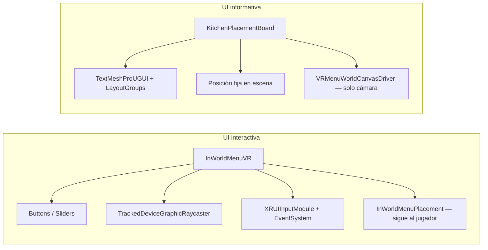

# World Space Canvas — Convenciones para agentes de IA

Guía para crear UI **World Space** en VR dentro de `CleanCore`. Resume el patrón que ya funciona en el menú de opciones (`InWorldMenuVR`) y en el tablero de cocina (`KitchenPlacementBoard`).

**Referencia de implementación:** `Assets/Scripts/UI/WorldSpaceCanvasBuilder.cs`  
**Menú interactivo (botones, sliders):** `VRMenuFactory.cs`  
**Panel informativo (solo lectura):** `KitchenPlacementBoardFactory.cs`

---

## Regla de oro: píxeles grandes + escala pequeña

Un Canvas World Space **no** usa metros en `sizeDelta`. Usa **píxeles lógicos** (como Screen Space) y escala el transform del canvas:

| Propiedad | Valor típico | Efecto físico aprox. |
|-----------|--------------|----------------------|
| `RectTransform.sizeDelta` | `(700–1000, 650–900)` px | Área de diseño |
| `transform.localScale` | `(0.002, 0.002, 0.002)` | ~1.4–2 m de ancho en mundo |
| `CanvasScaler.dynamicPixelsPerUnit` | `10` | Nitidez del texto |

**Anti-patrón (tablero roto):** `sizeDelta = (0.6, 0.8)` con `localScale = (1,1,1)` → panel de menos de 1 m pero tipografía pensada para cientos de píxeles; el texto queda ilegible o invisible.

```csharp
// Correcto — usar WorldSpaceCanvasBuilder
GameObject canvasGo = WorldSpaceCanvasBuilder.CreateCanvas(
    parent, "BoardCanvas", new Vector2(700, 900), sortingOrder: 15, interactive: false);
```

---

## Dos tipos de UI en este proyecto



| Tipo | Ejemplo | Raycaster | EventSystem | Posicionamiento |
|------|---------|-----------|-------------|-----------------|
| **Interactiva** | Menú configuración, modales, ayuda | `TrackedDeviceGraphicRaycaster` | Obligatorio (`VRMenuSceneServices.EnsureEventSystem`) | Relativo a `XROrigin` (`InWorldMenuPlacement`) |
| **Informativa** | Tablero cocina, contadores, checklist | No necesario | No necesario | Coordenadas mundo fijas o ancladas a objeto de escena |

---

## Checklist al crear un Canvas World Space

1. **`RenderMode.WorldSpace`** en el `Canvas`.
2. **`sizeDelta` en píxeles** (700+) y **`localScale ≈ 0.002`** — usar `WorldSpaceCanvasBuilder.CreateCanvas`.
3. **`VRMenuWorldCanvasDriver`** en el GameObject del canvas (asigna `worldCamera` al HMD / `Camera.main`).
4. **`CanvasScaler`** con `dynamicPixelsPerUnit = 10`.
5. **Texto:** siempre `TextMeshProUGUI` con `TMP_Settings.defaultFontAsset` (evita texto invisible sin fuente).
6. **Layout:** `VerticalLayoutGroup` / `HorizontalLayoutGroup` + `LayoutElement.preferredHeight` — evita posicionamiento manual frágil con `anchoredPosition`.
7. **Panel:** hijo `Image` con color semitransparente; márgenes con `offsetMin` / `offsetMax`.
8. **Orientación:** la UI se dibuja en **-local Z**; el root debe mirar al jugador con `LookRotation(-direcciónAlJugador)`.
9. **`FinalizeCanvas`** al terminar (o tras mover el root) para refrescar la cámara.

---

## Jerarquía recomendada

```
MyUIRoot                    ← Transform mundo (posición / rotación)
└── BoardCanvas             ← Canvas + CanvasScaler + VRMenuWorldCanvasDriver [+ Raycaster si interactivo]
    └── Panel               ← Image fondo + VerticalLayoutGroup
        ├── Title           ← TextMeshProUGUI
        ├── Item_...        ← filas de datos
        └── Counter         ← estado dinámico
```

**Nombres:** usar sufijo `Canvas` (`MenuCanvas`, `BoardCanvas`) para que scripts de placement encuentren el hijo con `transform.Find(...)`.

---

## Cuándo usar cada componente compartido

| Componente | Uso |
|------------|-----|
| `WorldSpaceCanvasBuilder` | Crear canvas, panel, TMP y layouts con valores estándar |
| `VRMenuWorldCanvasDriver` | Mantener `canvas.worldCamera` en XR (LateUpdate) |
| `VRMenuSceneServices.EnsureEventSystem` | Solo UI con botones/sliders clicables en VR |
| `InWorldMenuPlacement` | Menús que aparecen cerca del jugador al abrir |
| `KitchenPlacementBoardPlacement` | Paneles fijos en la escena (ej. cocina en `(2, 1.6, -3)`) |

---

## Patrones de retroalimentación al jugador

| Necesidad | Patrón | Referencia |
|-----------|--------|------------|
| Lista con estado (hecho / pendiente) | TMP por fila + diccionario `name → TextMeshProUGUI` | `KitchenPlacementBoard` |
| Contador global | Un TMP actualizado por evento | `KitchenPlacementBoard._counterText` |
| Mensaje de victoria / aviso | TMP oculto o vacío al inicio, rellenar en runtime | `ShowVictoryMessage` |
| Botones con hover VR | `Button` + `VRMenuButtonFeedback` + colores `ColorBlock` | `VRMenuFactory.CreateMenuButton` |
| Estadísticas en vivo | Polling o evento → TMP | `CleaningStatsAggregator` → menú |
| Modal confirmación | Overlay fullscreen `Image` alpha + panel centrado | `VRMenuFactory` → `ModalOverlay` |

### Eventos desacoplados (cocina)

```csharp
// Emisor
public static event Action<string, bool> OnPlacementChanged;

// Suscriptor UI
void OnEnable()  => KitchenSocketController.OnPlacementChanged += Handler;
void OnDisable() => KitchenSocketController.OnPlacementChanged -= Handler;
```

Preferir **eventos estáticos** o `UnityEvent` para separar lógica de juego de la UI cuando varios paneles escuchan lo mismo (`KitchenPlacementBoard`, `KitchenVictoryChecker`).

---

## Setup en editor vs runtime

| Enfoque | Cuándo | Ejemplo |
|---------|--------|---------|
| **Editor `[MenuItem]`** | Objetos permanentes en escena | `KitchenSocketSetup.CreatePlacementBoard` crea `KitchenPlacementBoard` en raíz |
| **Runtime factory** | UI que debe reaparecer tras recargar escena | `VRMenuRuntimeBootstrap` + `VRMenuFactory.CreateMenuInScene` |

Tras cambiar scripts de setup, el usuario debe ejecutar **Tools → Kitchen Socket → Setup All Sockets** para eliminar tableros legacy (`PlacementBoard` bajo `KitchenSockets` con escala incorrecta).

---

## Errores frecuentes

1. **`sizeDelta` en metros con `scale = 1`** — panel invisible o texto fuera de bounds.
2. **Sin `worldCamera`** — canvas World Space no renderiza; usar `VRMenuWorldCanvasDriver`.
3. **Sin fuente TMP por defecto** — asignar `TMP_Settings.defaultFontAsset`.
4. **Posicionar canvas hijo en mundo** — mover solo el **root**; el canvas hijo mantiene `localPosition = zero`, `localScale = 0.002`.
5. **UI interactiva sin `XRUIInputModule`** — ray del mando no golpea botones.
6. **Confundir capas XRI con capas Physics** — el tablero no usa capas de interacción; es solo render + opcional raycast UI.

---

## Archivos relacionados

| Archivo | Rol |
|---------|-----|
| `Assets/Scripts/UI/WorldSpaceCanvasBuilder.cs` | API compartida |
| `Assets/Scripts/VRMenu/VRMenuFactory.cs` | Menú interactivo completo |
| `Assets/Scripts/VRMenu/VRMenuWorldCanvasDriver.cs` | Asignación de cámara XR |
| `Assets/Scripts/VRMenu/VRMenuSceneServices.cs` | EventSystem + wiring |
| `Assets/Scripts/Kitchen/KitchenPlacementBoardFactory.cs` | Tablero checklist cocina |
| `Assets/Scripts/Kitchen/KitchenPlacementBoardPlacement.cs` | Posición fija en cocina |
| `Assets/Editor/KitchenSocketSetup.cs` | Crea tablero en escena |
| `Docs/VR_MENU_AGENT_CONTEXT.md` | Detalle específico del menú VR |
